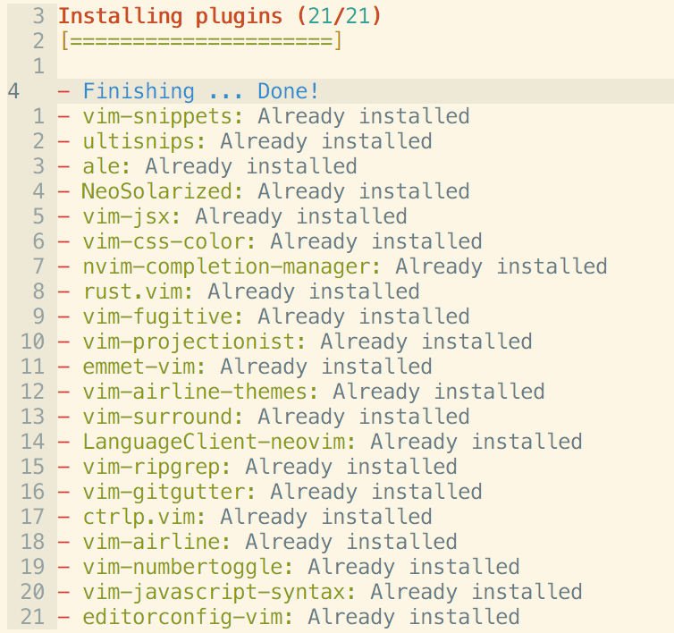

# vim-config
My ViM config

* theme solarized light with [NeoSolarized](https://github.com/icymind/NeoSolarized)
* auto-completion with [nvim-completion-manager](https://github.com/roxma/nvim-completion-manager) and [LanguageClient-neovim](https://github.com/autozimu/LanguageClient-neovim)
* fuzzy file with [ctrl.vim](https://github.com/kien/ctrlp.vim)
* zen-coding with [emmet-vim](https://github.com/mattn/emmet-vim)
* asynchronous linting with [ALE](https://github.com/w0rp/ale)
* editorconfig with [editorconfig-vim](https://github.com/editorconfig/editorconfig-vim)
* javascript syntax with [vim-javascript-syntax](https://github.com/jelera/vim-javascript-syntax)
* git integration with [vim-fugitive](https://github.com/tpope/vim-fugitive) and [vim-gitgutter](https://github.com/airblade/vim-gitgutter)
* ... To be continued.

## Bindings

### Standard

`gd`
: Go to definition

`ga`
: LSP Code action

`g[`
: Go to previous warning/error

`g]`
: Go to next warning/error

`<leader>ff`
: Fuzzy find file

`<leader>fg`
: Fuzzy find in file (live grep)

`<leader>fb`
: Find in buffer

`<leader>fh`
: Help tags

`gh`
: Show definition and references 

`<leader>ca`
: Code action

`<leader>ca :<C-U>`
: Range code action

`K`
: Hover doc

`gs`
: Signature Help

`gr`
: Rename

`<leader>cd`
: Show line diagnostic`

`<leader>cc`
: Show cursor diagnostic

`[e`
: Show previous diagnostic

`]e`
: Show next diagnostic`

`ff`
: Format file

### Completion

`<C-p>` | `<S-Tab>`
: Previous item

`<C-n>` | `<Tab>`
: Next item

`<C-d>`
: Scroll docs -4

`<C-f>`
: Scroll docs +4 

`<C-Space>`
: Mapping complete

`<C-e>`
: Mapping close

`<CR>`
: Mapping confirm


## Requirements

### Install python 3

```shell
brew install python3
```

### Install neovim client python

```
pip3 install neovim
```

### Install tree sitter

```
brew install tree-sitter
```

### Install other Requirements

```
brew install rg fd
```


### [Install vim-plug](https://github.com/junegunn/vim-plug#neovim)

### Install plugins



```
nvim +PlugInstall +qall
```

### Install specific autocompletions

```
nvim +"TSUpdate rust" +qall
```

### Install specific tools (for example rust-analyzer for rust)

```
brew install rust-analyzer
```
